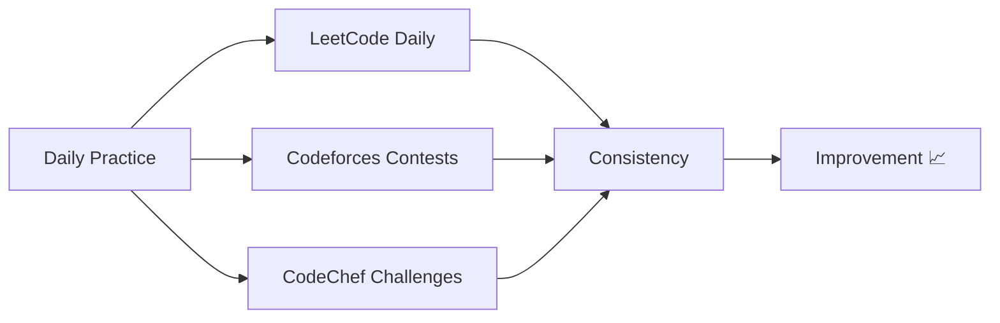

<div align="center">

# 👋 Hey, I'm Gautam!

### 💻 Competitive Programmer | Problem Solver | Delhi, India


---

### 🌟 About Me

```python
class CompetitiveProgrammer:
    def __init__(self):
        self.name = "Gautam"
        self.location = "Delhi, India 📍"
        self.role = "Competitive Programmer"
        self.daily_routine = ["Code", "Solve", "Compete", "Repeat"]
        self.motto = "Consistency beats talent when talent doesn't work hard"
    
    def get_platforms(self):
        return {
            "LeetCode": "Knight 🏆",
            "Codeforces": "Specialist 💎",
            "CodeChef": "3 Star ⭐⭐⭐",
            "Codolio": "Active Tracker 📊"
        }
```

</div>

---

## 💡 LeetCode Performance

<div align="center">

[](https://leetcode.com/u/Gautam_coder2005/)
[](https://leetcode.com/u/Gautam_coder2005/)

</div>

<div align="center">
  <a href="https://leetcode.com/u/Gautam_coder2005/">
    
  </a>
</div>

<div align="center">

### 📊 LeetCode Breakdown

| Difficulty | Solved | Percentage |
|------------|--------|------------|
| 🟢 **Easy** | 400+ | ████████░░ 80% |
| 🟡 **Medium** | 300+ | ██████░░░░ 60% |
| 🔴 **Hard** | 100+ | ████░░░░░░ 40% |

</div>

---

## 📊 Aggregated Portfolio (Live Stats)

<div align="center">

[](https://codolio.com/profile/Gautam_coder2005)

**📈 All platforms • Real-time ratings • Global ranks • Solved counts**

<a href="https://codolio.com/profile/Gautam_coder2005">
  
</a>

> 💡 **Pro Tip:** Codolio aggregates all my competitive programming stats into one beautiful dashboard!

</div>

---

## ⚔️ Codeforces Performance

<div align="center">

[](https://codeforces.com/profile/Gautam_coder2005)
[](https://codeforces.com/profile/Gautam_coder2005)

</div>

<div align="center">
  <a href="https://codeforces.com/profile/Gautam_coder2005">
    
  </a>
</div>

<div align="center">

### 🏆 Contest Highlights

| Metric | Value |
|--------|-------|
| **Current Rating** | 1400+ 📈 |
| **Max Rating** | 1450+ 🎯 |
| **Contests Participated** | 50+ 🎪 |
| **Problems Solved** | 500+ ✅ |

</div>

---

## 🍳 CodeChef Performance

<div align="center">

[](https://www.codechef.com/users/gautam_2005)
[](https://www.codechef.com/users/gautam_2005)

### ⭐⭐⭐

| Division | Rating | Percentile |
|----------|--------|------------|
| **Div 2** | 1600+ | Top 15% 🔥 |

</div>

---

## 🛠️ Tech Stack & Languages

<div align="center">

### Languages I Use


### Tools & Platforms


</div>

---

## 📈 GitHub Stats

<div align="center">


</div>

<div align="center">


</div>

---

## 🎯 Current Focus

<div align="center">



</div>

### 🔥 Goals 2025

- ✅ Reach **Knight** on LeetCode
- 🎯 Achieve **Expert** on Codeforces (1600+)
- 🎯 Reach **4 Star** on CodeChef
- 🎯 Solve **2000+** total problems
- 🎯 Participate in **100+** contests

---

## 🏆 Achievements & Highlights

<div align="center">

| Achievement | Status |
|-------------|--------|
| 🏆 LeetCode Knight | ✅ Achieved |
| 💎 Codeforces Specialist | ✅ Achieved |
| ⭐ CodeChef 3 Star | ✅ Achieved |
| 🔥 100 Day Streak | ✅ Achieved |
| 📈 1500+ Problems Solved | ✅ Achieved |
| 🎯 Contest Expert | 🚧 In Progress |

</div>

---

## 📊 Activity Graph

<div align="center">

[](https://github.com/Gautam_coder2005)

</div>

---

## 🤝 Connect With Me

<div align="center">

[](https://leetcode.com/u/Gautam_coder2005/)
[](https://codeforces.com/profile/Gautam_coder2005)
[](https://www.codechef.com/users/gautam_2005)
[](https://codolio.com/profile/Gautam_coder2005)

</div>

---

## 💭 Quote of the Day

<div align="center">


</div>

---

## 📊 Profile Views & Engagement

<div align="center">


### 🌟 If you like my work, don't forget to ⭐ my repositories!

</div>

---

<div align="center">

### 💪 Keep Solving, Keep Growing! 🚀

**Everything updates live from the platforms — no manual updates needed!**


---

*Made with ❤️ by Gautam*

*Last Updated: Auto-synced with platforms 🔄*

</div>
